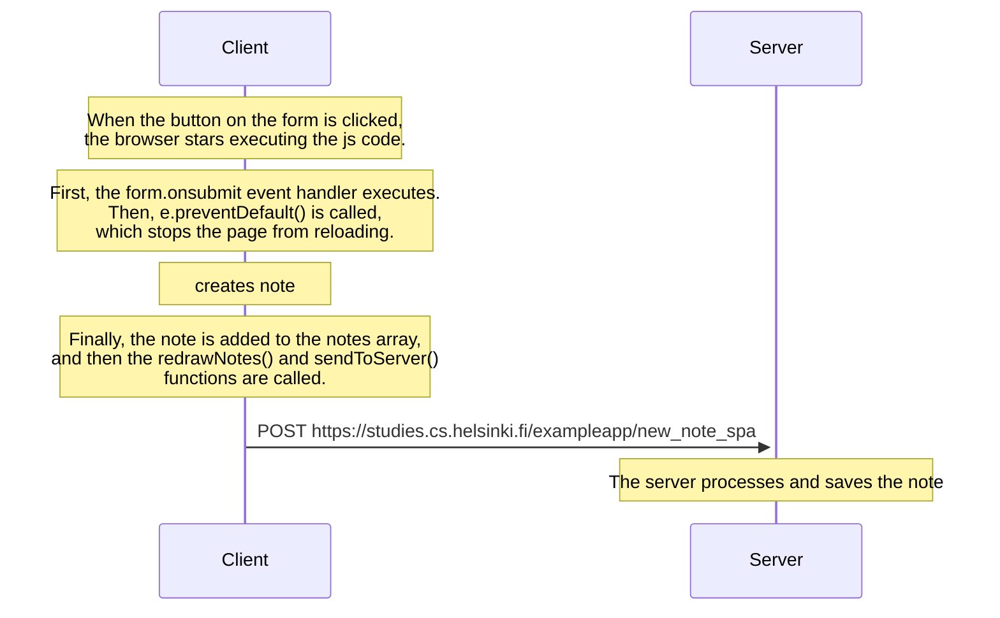

```mermaid
    sequenceDiagram
        note over Client: When the button on the form is clicked,<br/> the browser stars executing the js code.
        note over Client: First, the form.onsubmit event handler executes.<br/> Then, e.preventDefault() is called,<br/> which stops the page from reloading.
        note over Client: creates note
        note over Client: Finally, the note is added to the notes array,<br/> and then the redrawNotes() and sendToServer()<br/> functions are called.
        Client->>+Server:  POST https://studies.cs.helsinki.fi/exampleapp/new_note_spa
        note over Server: The server processes and saves the note
```
