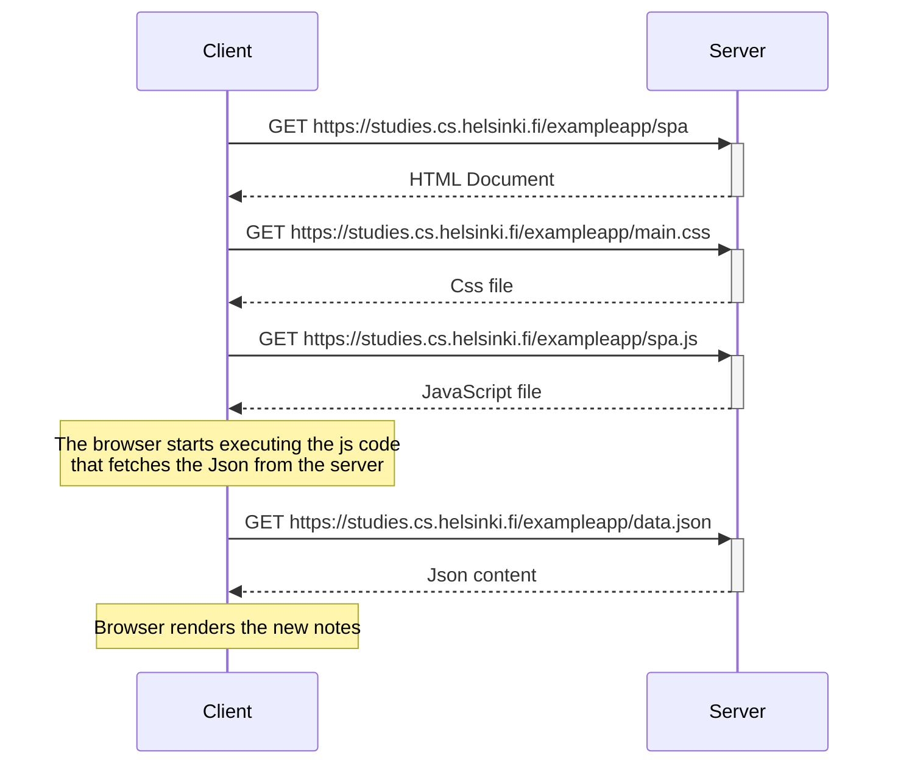

```mermaid
    sequenceDiagram
        Client->>+Server: GET https://studies.cs.helsinki.fi/exampleapp/spa
        Server-->>-Client: HTML Document
        Client->>+Server: GET https://studies.cs.helsinki.fi/exampleapp/main.css
        Server-->>-Client:Css file
        Client->>+Server: GET https://studies.cs.helsinki.fi/exampleapp/spa.js
        Server-->>-Client: JavaScript file
        note over Client: The browser starts executing the js code<br/> that fetches the Json from the server 
        Client->>+Server: GET https://studies.cs.helsinki.fi/exampleapp/data.json
        Server-->>-Client: Json content
        note over Client: Browser renders the new notes
```